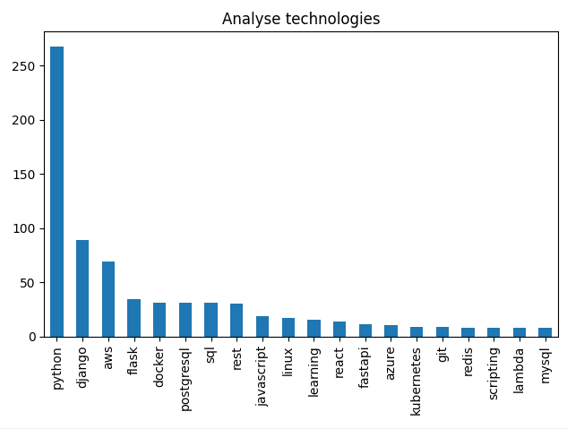

# Djinni analyse technologies

Analyse demanded technologies on Djinni. <br>
Use next commands: <br>
    new [exp] - new analyse. if exp is nan - analyse all data <br>
    load [file1] [exp] - analyse exists data. if exp is nan - analyse all data <br>
    comp [file1] [file2] [exp] - compare two datas. file1 must be older file. if exp is nan - analyse all data <br>



## Installing / Getting started

A quick introduction of the minimal setup you need

```shell
git clone https://github.com/volodymyr-vereshchak/py-djinni-analysis.git
cd py-djinni-analysis
python -m venv venv
venv\Scripts\activate
pip install -r requirements.txt
```
